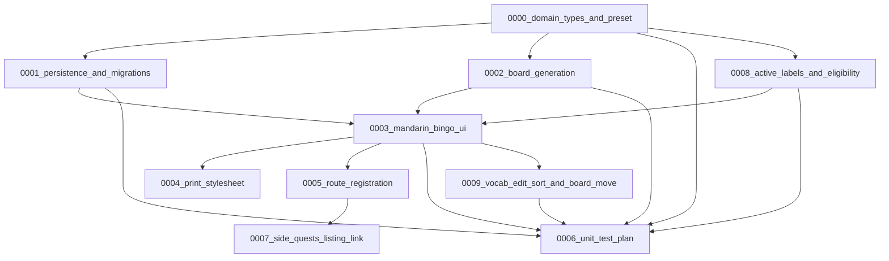

# Side Quests — Wave 1

Implementation specs for the **Side Quests** tab and the **Mandarin character bingo** mini-app.

**Governing ADRs:** [0000 — Side Quests tab](../../../adrs/side_quests/0000_side_quests_tab.md), [0001 — Mandarin bingo](../../../adrs/side_quests/0001_mandarin_bingo_generator.md)

## Definition of done (implementation follow-up)

Wave_1 implementation is complete when:

1. ADRs + these specs are reconciled (this doc pass).
2. Features in the DAG below are implemented and unit tests from [0006](./0006_unit_test_plan.md) (plus 0008/0009 edge matrix) pass.
3. A **first git commit** is created for the work.
4. The implementer provides a **summary** with how to verify locally (unit-test command + `ng serve` / localhost).

**Out of scope for done:** S3/CloudFront deploy (owner publishes manually).

## Specs in this wave

| Spec | Title | Focus | Status |
|---|---|---|---|
| [0000](./0000_domain_types_and_preset.md) | Domain types and preset | Types with Class/Label/`excludedByUser`; verified preset | Completed |
| [0001](./0001_persistence_and_migrations.md) | Persistence and migrations | Vocab envelope; no board/toggle/`activeLabels` persist | Completed |
| [0002](./0002_board_generation.md) | Board + preset table | Verified traditional vocab; place/fill; Fisher–Yates | Completed |
| [0003](./0003_mandarin_bingo_ui.md) | Bingo UI | Vocab row layout; exclude; confirm reset; place; pinyin | Completed |
| [0004](./0004_print_stylesheet.md) | Print | `window.print()`; respects session pinyin toggle | Completed |
| [0005](./0005_route_registration.md) | Route | `side-quests/mandarin-bingo` | Completed |
| [0006](./0006_unit_test_plan.md) | Unit tests | Fixtures, eligibility, partial fill, listing | Completed |
| [0007](./0007_side_quests_listing_link.md) | Side Quests listing | Icon, title, description, date; `router_link` | Completed |
| [0008](./0008_active_labels_and_eligibility.md) | Active labels + eligibility | Two-layer model; Option A; session `activeLabels`; `x/n` | Completed |
| [0009](./0009_vocab_edit_sort_and_board_move.md) | Edit, sort, board move | Edit dialog; sort; row layout; drag ghost; swap/move/fade | Completed |

## Implementation DAG

### Parallelism hints

- After **0000**: **0001**, **0002**, and **0006** fixtures can proceed in parallel.
- **0008** builds on **0000** and feeds **0003** / **0006**.
- **0003** waits on **0001** + **0002** (+ **0008** for eligibility UX).
- **0009** extends **0003**.
- **0004** and **0005** parallel after **0003**.
- **0007** waits on **0005** (tab listing + bingo catalog row).
